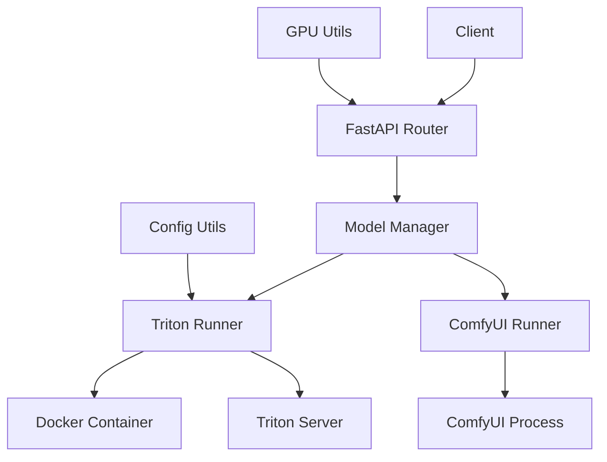

# Model Inference Client API 接口文档

## 概述

Model Inference Client 是一个用于管理模型推理服务的统一API服务器，支持 Triton Inference Server 和 ComfyUI 等多种推理后端。该服务提供了在多GPU环境下启动、停止和监控模型实例的完整解决方案。

**基础信息：**
- **服务地址**: `http://localhost:6004`
- **API版本**: v1
- **API前缀**: `/api/v1`
- **文档地址**: `http://localhost:6004/docs`

## 系统架构



### 核心组件

1. **Model Manager**: 单例模式的模型生命周期管理器
2. **Base Runner**: 抽象基类，定义统一的运行器接口
3. **Triton Runner**: Triton Inference Server 的具体实现
4. **ComfyUI Runner**: ComfyUI 的具体实现（待完善）
5. **GPU Utils**: GPU状态监控和进程管理工具

## 数据模型

### 枚举类型

#### ModelType
```python
class ModelType(str, Enum):
    TRITON = "triton"
    COMFYUI = "comfyui"
```

#### ModelInstanceStatus
```python
class ModelInstanceStatus(str, Enum):
    STARTING = "STARTING"
    RUNNING = "RUNNING"
    STOPPED = "STOPPED"
    ERROR = "ERROR"
```

### 请求模型

#### StartRequest
启动模型的请求参数

```json
{
  "model_name": "string",
  "gpu_id": 0,
  "config": {}
}
```

**字段说明：**
- `model_name`: 模型名称，必须是配置中支持的模型（系统会自动从配置中判断模型类型）
- `gpu_id`: 目标GPU设备ID（≥0）
- `config`: 后端特定的配置选项（可选）

#### StopRequest
停止模型的请求参数

```json
{
  "model_name": "string",
  "gpu_id": 0
}
```

**字段说明：**
- `model_name`: 模型名称（系统会自动从配置中判断模型类型）
- `gpu_id`: 目标GPU设备ID（≥0）

### 响应模型

#### ModelInstanceInfo
模型实例的详细信息

```json
{
  "model_name": "string",
  "model_type": "triton | comfyui",
  "active_gpu_ids": [0, 1],
  "total_instances": 2,
  "status": "RUNNING",
  "pid": 12345,
  "port": 8000,
  "created_at": "2024-01-01T00:00:00.000Z",
  "updated_at": "2024-01-01T00:00:00.000Z"
}
```

#### ModelStatusItem
简化的模型状态信息

```json
{
  "model_name": "string",
  "model_type": "string",
  "gpu_id": 0
}
```

#### GPUInfo
GPU状态信息

```json
{
  "id": 0,
  "memory_usage": 45.5,
  "power_draw": 150.7,
  "processes": [
    {
      "pid": 12345,
      "name": "python",
      "gpu_memory_usage": 4096
    }
  ]
}
```

#### KillProcessResponse
进程终止响应

```json
{
  "pid": 12345,
  "status": "killed | error",
  "message": "string"
}
```

## API 端点详细说明

### 健康检查

#### GET /
根端点健康检查

**响应：**
```json
{
  "status": "ok",
  "message": "Welcome to the Model Inference Client API"
}
```

### GPU 和进程管理

#### GET /api/v1/gpus
获取所有GPU的状态信息

**响应：**
- **状态码**: 200 OK
- **响应体**: `List[GPUInfo]`

**示例响应：**
```json
[
  {
    "id": 0,
    "memory_usage": 45.5,
    "power_draw": 150.7,
    "processes": [
      {
        "pid": 12345,
        "name": "tritonserver",
        "gpu_memory_usage": 4096
      }
    ]
  }
]
```

**错误响应：**
- **501 Not Implemented**: nvidia-ml-py 未安装
- **500 Internal Server Error**: 获取GPU信息失败

#### DELETE /api/v1/processes/{pid}
通过PID终止进程

**路径参数：**
- `pid` (integer): 进程ID

**响应：**
- **状态码**: 200 OK
- **响应体**: `KillProcessResponse`

**示例响应：**
```json
{
  "pid": 12345,
  "status": "killed"
}
```

**错误响应：**
- **404 Not Found**: 进程不存在
- **403 Forbidden**: 权限不足
- **500 Internal Server Error**: 其他错误

### 模型管理

#### POST /api/v1/models/start
在指定GPU上启动模型

**请求体**: `StartRequest`

**示例请求：**
```json
{
  "model_name": "MAM",
  "gpu_id": 0,
  "config": {}
}
```

**响应：**
- **状态码**: 202 Accepted
- **响应体**: `ModelInstanceInfo`

**示例响应：**
```json
{
  "model_name": "MAM",
  "model_type": "triton",
  "active_gpu_ids": [0],
  "total_instances": 8,
  "status": "STARTING",
  "pid": 12345,
  "port": 8000,
  "created_at": "2024-01-01T00:00:00.000Z",
  "updated_at": "2024-01-01T00:00:00.000Z"
}
```

**错误响应：**
- **400 Bad Request**: 请求参数无效
- **500 Internal Server Error**: 启动失败

#### POST /api/v1/models/stop
在指定GPU上停止模型

**请求体**: `StopRequest`

**示例请求：**
```json
{
  "model_name": "MAM",
  "gpu_id": 0
}
```

**响应：**
- **状态码**: 200 OK
- **响应体**: `ModelInstanceInfo`

**错误响应：**
- **400 Bad Request**: 请求参数无效
- **404 Not Found**: 模型未找到或未在指定GPU上运行
- **500 Internal Server Error**: 停止失败

#### GET /api/v1/models/status
获取所有运行中模型的状态

**响应：**
- **状态码**: 200 OK
- **响应体**: `List[ModelStatusItem]`

**示例响应：**
```json
[
  {
    "model_name": "MAM",
    "model_type": "triton",
    "gpu_id": 0
  },
  {
    "model_name": "FastFitAll",
    "model_type": "triton",
    "gpu_id": 1
  }
]
```

#### GET /api/v1/models/status/{model_name}
获取指定模型的状态

**路径参数：**
- `model_name` (string): 模型名称

**响应：**
- **状态码**: 200 OK
- **响应体**: `List[ModelStatusItem]`

**错误响应：**
- **404 Not Found**: 模型未找到

## 配置说明

### 支持的模型

系统通过配置文件自动识别模型类型，无需在API调用时指定：

#### Triton 模型
- **MAM**: 每GPU 8个实例，自动识别为 triton 类型
- **FastFitAll**: 每GPU 1个实例，自动识别为 triton 类型

#### ComfyUI 模型
- **chane_face**: 待实现，自动识别为 comfyui 类型

**模型类型映射逻辑：**
系统会遍历 `RUNNERS_CONFIG` 中的每个运行器配置，检查模型名称是否在对应的 `supported_models` 列表中，从而自动确定模型类型。

### 配置文件结构

配置位于 [`model_inference_client/config.py`](model_inference_client/config.py)：

```python
TRITON_RUNNER_CONFIG = {
    "image_name": "nvcr.io/nvidia/tritonserver:25.04-py3",
    "container_name": "triton_server",
    "model_repository_host_path": "/mnt/sdb_data/triton_inference_server/model_repository",
    "runtime_host_path": "/mnt/sdb_data/triton_inference_server/runtime",
    "http_port": 8000,
    "grpc_port": 8001,
    "metrics_port": 8002,
    "shm_size": "2g",
    "gpus": "all",
    "api_timeout_seconds": 120,
    "model_gpu_configs": {
        "MAM": {"instances_per_gpu": 8},
        "FastFitAll": {"instances_per_gpu": 1},
        "default": {"instances_per_gpu": 1}
    },
    "supported_models": ["MAM", "FastFitAll"]
}
```

## 错误处理

### 标准错误格式

所有API错误都遵循FastAPI标准格式：

```json
{
  "detail": "错误描述信息"
}
```

### 常见错误码

- **400 Bad Request**: 请求参数无效或缺失
- **403 Forbidden**: 权限不足（如终止进程）
- **404 Not Found**: 资源未找到（模型、进程等）
- **500 Internal Server Error**: 服务器内部错误
- **501 Not Implemented**: 功能未实现（如GPU监控依赖缺失）

## 使用示例

### 启动模型

```bash
curl -X POST "http://localhost:6004/api/v1/models/start" \
  -H "Content-Type: application/json" \
  -d '{
    "model_name": "MAM",
    "gpu_id": 0
  }'
```

### 查看GPU状态

```bash
curl -X GET "http://localhost:6004/api/v1/gpus"
```

### 停止模型

```bash
curl -X POST "http://localhost:6004/api/v1/models/stop" \
  -H "Content-Type: application/json" \
  -d '{
    "model_name": "MAM",
    "gpu_id": 0
  }'
```

### 查看模型状态

```bash
curl -X GET "http://localhost:6004/api/v1/models/status"
```

## 部署指南

### 环境要求

- Python 3.8+
- Docker
- NVIDIA GPU + CUDA
- nvidia-ml-py (用于GPU监控)

### 安装步骤

1. **安装依赖**：
```bash
pip install -r model_inference_client/requirements.txt
```

2. **启动服务**：
```bash
uvicorn model_inference_client.main:app --host 0.0.0.0 --port 6004 --reload
```

3. **访问文档**：
打开浏览器访问 `http://localhost:6004/docs`

### Docker 部署

服务依赖于Docker来运行Triton容器，确保Docker服务正在运行且当前用户有权限访问Docker。

## 注意事项

1. **Triton模型配置**: 需要在模型目录下提供 `config.pbtxt.template` 文件
2. **GPU资源管理**: 系统会自动管理GPU资源分配，避免冲突
3. **容器生命周期**: Triton容器会在没有活跃模型时自动停止
4. **异步操作**: 模型启动是异步的，状态会从 `STARTING` 变为 `RUNNING`
5. **ComfyUI支持**: 当前ComfyUI Runner仅为框架，具体实现待完善

## 扩展开发

### 添加新的推理后端

1. 继承 [`BaseRunner`](model_inference_client/runners/base_runner.py) 类
2. 实现 `start()`, `stop()`, `get_status()` 方法
3. 在 [`config.py`](model_inference_client/config.py) 中添加配置
4. 在 [`ModelManager`](model_inference_client/services/model_manager.py) 中注册新的Runner

### 示例：添加vLLM支持

```python
from .base_runner import BaseRunner
from ..models.schemas import ModelInstanceInfo

class vLLMRunner(BaseRunner):
    def start(self, model_name: str, gpu_id: int, **kwargs) -> ModelInstanceInfo:
        # 实现vLLM启动逻辑
        pass
    
    def stop(self, instance: ModelInstanceInfo) -> None:
        # 实现vLLM停止逻辑
        pass
    
    def get_status(self, instance_id: str) -> ModelInstanceInfo:
        # 实现vLLM状态检查逻辑
        pass
```

---

## 常见问题解答 (FAQ)

### Q: 如何检查模型是否成功启动？
A: 调用 `GET /api/v1/models/status/{model_name}` 检查模型状态。状态从 `STARTING` 变为 `RUNNING` 表示启动成功。

### Q: 为什么模型启动后状态一直是 STARTING？
A: 可能的原因：
1. 模型文件缺失或损坏
2. GPU内存不足
3. 配置文件错误
4. Docker容器启动失败

建议检查容器日志：`docker logs triton_server`

### Q: 如何在同一个GPU上运行多个不同模型？
A: 分别调用启动接口，指定相同的 `gpu_id` 但不同的 `model_name`。系统会自动管理资源分配。

### Q: 如何清理僵尸进程？
A: 使用 `DELETE /api/v1/processes/{pid}` 接口终止指定进程，或重启整个服务。

### Q: ComfyUI 支持什么时候完善？
A: ComfyUI Runner 目前仅为框架实现，具体功能开发中。可参考扩展开发章节自行实现。

## 性能优化建议

### GPU 内存管理
- 监控GPU内存使用率，避免超载
- 合理配置每个模型的 `instances_per_gpu` 参数
- 定期清理不使用的模型实例

### 并发处理
- 使用多个GPU分散负载
- 根据模型特性调整实例数量
- 监控系统资源使用情况

### 网络优化
- 在生产环境中使用反向代理（如Nginx）
- 配置适当的超时时间
- 启用HTTP/2支持

## 监控和日志

### 系统监控
```bash
# 查看GPU状态
curl -X GET "http://localhost:6004/api/v1/gpus"

# 查看所有模型状态
curl -X GET "http://localhost:6004/api/v1/models/status"

# 查看Docker容器状态
docker ps --filter name=triton_server
```

### 日志查看
```bash
# 查看API服务日志
tail -f /var/log/model_inference_client.log

# 查看Triton容器日志
docker logs -f triton_server

# 查看系统资源使用
nvidia-smi
htop
```

## 安全考虑

### 访问控制
- 在生产环境中配置防火墙规则
- 使用API密钥或JWT令牌进行身份验证
- 限制进程终止接口的访问权限

### 资源隔离
- 使用Docker容器隔离运行环境
- 配置适当的资源限制
- 监控异常进程和资源使用

## 故障排除

### 常见错误及解决方案

#### 1. Docker 相关错误
```
Error: Cannot connect to the Docker daemon
```
**解决方案**: 确保Docker服务运行且用户有权限访问

#### 2. GPU 不可用
```
Error: CUDA device not found
```
**解决方案**: 检查NVIDIA驱动和CUDA安装，确保Docker支持GPU

#### 3. 端口冲突
```
Error: Port 8000 already in use
```
**解决方案**: 修改配置文件中的端口设置或停止占用端口的进程

#### 4. 模型配置错误
```
Error: Could not generate config for model
```
**解决方案**: 检查模型目录下是否存在 `config.pbtxt.template` 文件

### 调试步骤

1. **检查服务状态**
   ```bash
   curl -X GET "http://localhost:6004/"
   ```

2. **验证GPU可用性**
   ```bash
   nvidia-smi
   ```

3. **检查Docker容器**
   ```bash
   docker ps -a --filter name=triton_server
   ```

4. **查看详细日志**
   ```bash
   docker logs triton_server
   ```

